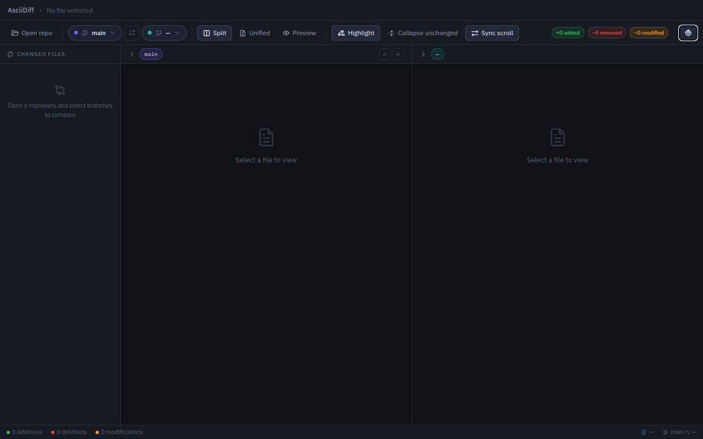
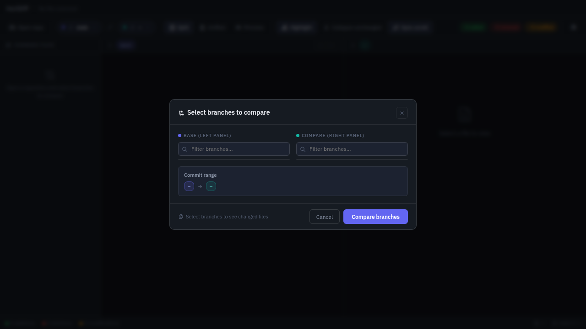
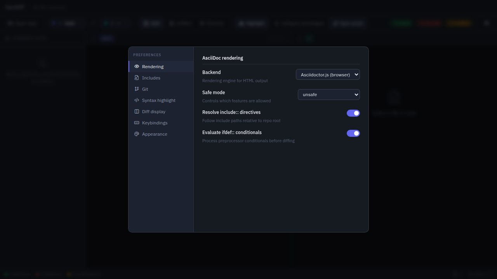

# AsciiDiff

A desktop application for comparing rendered AsciiDoc files across git branches, commits, and tags. Built with Rust + Tauri v2 + Svelte 5.



## Features

- **Side-by-side diff** of rendered AsciiDoc documents between any two git refs (branches, tags, commits)
- **Word-level diff highlighting** shows exactly what changed
- **Split, Unified, and Preview** view modes
- **File tree sidebar** grouped by change type (Modified, Added, Deleted)
- **AsciiDoc rendering** including headings, code blocks, admonitions, tables, lists
- **`include::` directive resolution** from git object store (not working directory)
- **Sync scroll** between left and right panels
- **Collapse unchanged sections** to focus on what matters
- **Keyboard shortcuts** for fast navigation

## Screenshots

### Branch Selection



### Settings



## Getting Started

### Prerequisites

- [Rust](https://rustup.rs/) (stable)
- [Node.js](https://nodejs.org/) 20+
- Linux: `libwebkit2gtk-4.1-dev libgtk-3-dev libayatana-appindicator3-dev librsvg2-dev`

### Development

```bash
make dev
```

Or manually:

```bash
cd frontend
npm install
npm run tauri dev
```

### Build

```bash
# Linux AppImage (requires Docker/Podman)
./scripts/build-appimage.sh

# Or directly (produces platform-native bundles)
cd frontend && npx tauri build
```

### Test

```bash
make test          # Run all tests (Rust + Playwright)
make test-repo     # Create test git repo with sample AsciiDoc files
```

## Architecture

```
frontend/
├── src/                    # Svelte 5 frontend
│   ├── App.svelte          # Main app shell
│   └── lib/
│       ├── components/     # UI components
│       └── stores/         # Application state
├── src-tauri/
│   ├── src/
│   │   ├── lib.rs          # Tauri commands + include resolution
│   │   ├── git.rs          # git2 operations
│   │   └── render.rs       # AsciiDoc renderer + diff engine
│   └── Cargo.toml
├── tests/                  # Playwright e2e tests
└── package.json
```

## Tech Stack

| Layer | Technology |
|-------|-----------|
| Desktop runtime | [Tauri v2](https://v2.tauri.app/) |
| Backend | Rust (git2, similar) |
| Frontend | Svelte 5 + Vite |
| Diff engine | [similar](https://crates.io/crates/similar) (word-level) |
| Git operations | [git2](https://crates.io/crates/git2) |

## Keyboard Shortcuts

| Shortcut | Action |
|----------|--------|
| `Ctrl+B` | Open branch selector |
| `Ctrl+S` | Toggle sync scroll |
| `Ctrl+E` | Toggle collapse unchanged |
| `Ctrl+,` | Open settings |
| `Ctrl+↑/↓` | Navigate between diffs |
| `Esc` | Close modals |

## License

MIT
